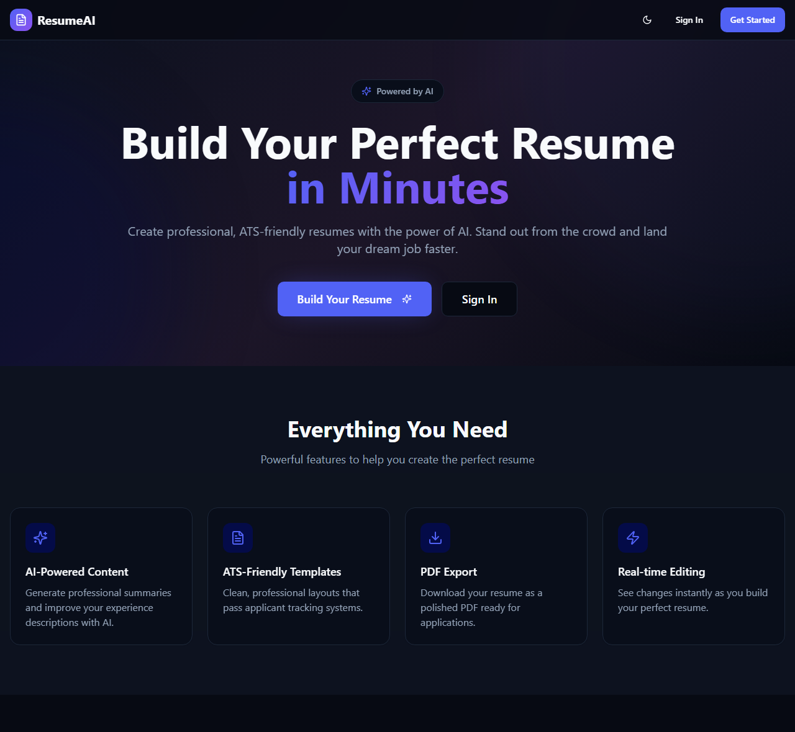

# ResumeAI: AI Resume Builder

A full-stack resume builder: write your resume with a live preview, get a transparent score with
concrete fixes, use AI to write and tailor content, and export a PDF that applicant tracking
systems (ATS) can actually read.

**Live:** https://resume-genius-jet.vercel.app



## Features

- **Auth and storage.** Supabase Auth (email/password); resumes stored in Postgres with row-level
  security, so each user can only read and change their own resumes.
- **Builder.** Personal info, summary, experience, education, projects and skills, with a live
  preview, three templates, font switching, dark mode, autosave and an unsaved-changes warning.
- **Resume score (0-100).** Computed by fixed, unit-tested rules, not by AI: contact details,
  summary length, action verbs, measurable results, bullet length, weak phrases, skills and
  education. It updates as you type, and every missing point comes with a tip.
- **AI writing help** (Node.js + Express + OpenAI):
  - generate a professional summary
  - rewrite experience bullets
  - suggest skills for a role
  - written feedback: strengths, areas to improve, suggestions
- **Job description tailoring.** Paste a job description to see a keyword match (matched and
  missing keywords) and an AI-tailored summary with skills reordered by relevance. Tailoring can't
  add a skill your resume doesn't already show: the server removes any skill without evidence.
- **ATS-readable PDF export.** Export goes through the browser's "Save as PDF", so the PDF has
  real, selectable text and clickable links (canvas-based exporters produce an image of the page).

## Architecture

```text
Browser (React + Vite SPA)
  │  Supabase JS ──────────────▶ Supabase Auth + Postgres (resumes table, row-level security)
  │
  │  POST /api/ai/*  (Authorization: Bearer <Supabase access token>)
  ▼
Node.js + Express API  (Vercel serverless function: api/index.ts → server/app.ts)
  ├─ helmet, strict CORS, 100 KB body limit
  ├─ requireUser: verifies the token with Supabase Auth
  ├─ rate limit per user (default 20 requests / 10 min)
  ├─ Zod validation with length caps on every field
  ├─ OpenAI Responses API with structured outputs (Zod schema → JSON schema)
  └─ output sanitization (length caps, de-duplication, evidence check for tailored skills)
```

| Endpoint              | Purpose                                       |
| --------------------- | --------------------------------------------- |
| `GET /api/health`     | Health check                                  |
| `POST /api/ai/summary` | Generate a professional summary              |
| `POST /api/ai/bullets` | Rewrite experience bullets (one per input)   |
| `POST /api/ai/skills`  | Suggest new skills for a job role            |
| `POST /api/ai/review`  | Written feedback (no score)                  |
| `POST /api/ai/tailor`  | Tailor summary and skills to a job description |

Errors always have the shape `{ "error": { "code": "...", "message": "..." } }` with a message that
is safe to show in the UI.

### Design decisions

- **The score is deterministic.** A number from an LLM changes every time you ask and can't be
  explained. The score is a pure function ([src/lib/ats-score.ts](src/lib/ats-score.ts)); AI
  only writes feedback.
- **AI output is untrusted input.** Responses must match a Zod schema (structured outputs), are
  validated again, and are capped and cleaned before they reach the UI. Refusals and truncated
  answers produce an error instead of a made-up result.
- **Prompt-injection hardening.** Resume and job text are sent inside `<data>` tags, and the model
  is told to treat that block as content, never as instructions.
- **Privacy.** Contact details (email, phone, LinkedIn) are never sent to the AI.
- **Cost control.** AI endpoints require sign-in, are rate-limited per user, and have capped
  input sizes.

## Tech stack

React 18, TypeScript, Vite, Tailwind CSS, shadcn/ui · Node.js, Express 5, Zod, OpenAI SDK ·
Supabase (Auth + Postgres) · Vitest, Supertest · GitHub Actions · Vercel

## Getting started

Requirements: Node.js 20.12+ and a free [Supabase](https://supabase.com) project.

1. **Create the database.** In your Supabase project, open the SQL editor and run
   [supabase/migrations/20260107183059_6527736a-41c0-40f3-b370-44a63e680447.sql](supabase/migrations/20260107183059_6527736a-41c0-40f3-b370-44a63e680447.sql)
   (creates the `resumes` table and its row-level security policies).
2. **Configure.** Put your project's URL and publishable (anon) key in `.env`:
   ```bash
   VITE_SUPABASE_URL=https://<project>.supabase.co
   VITE_SUPABASE_PUBLISHABLE_KEY=<publishable key>
   ```
   Then put secrets in `.env.local`, which is git-ignored (see [.env.example](.env.example)):
   ```bash
   OPENAI_API_KEY=sk-...
   ```
3. **Run.**
   ```bash
   npm install
   npm run dev        # web on http://localhost:8080, API on http://localhost:3001
   ```

The Supabase URL and publishable key are public by design (they ship in the browser bundle);
row-level security is what protects the data. The OpenAI key is secret and only ever used by the
server.

## Deploying to Vercel

Vercel builds the Vite app and deploys `api/index.ts` as a Node.js function
([vercel.json](vercel.json) routes `/api/*` to it and everything else to the SPA). In **Project →
Settings → Environment Variables**, set:

| Variable                                        | Required | Notes                                   |
| ----------------------------------------------- | -------- | --------------------------------------- |
| `OPENAI_API_KEY`                                | yes      | Secret                                  |
| `SUPABASE_URL`, `SUPABASE_PUBLISHABLE_KEY`      | yes      | Same values as the `VITE_` ones         |
| `VITE_SUPABASE_URL`, `VITE_SUPABASE_PUBLISHABLE_KEY` | if not in `.env` | Used at build time         |
| `OPENAI_MODEL`                                  | no       | Default `gpt-5.4-mini`                  |
| `AI_RATE_LIMIT_PER_10_MIN`                      | no       | Default 20                              |

Without an OpenAI key, the AI endpoints answer `503 NOT_CONFIGURED` and the rest of the app still
works. The rate limiter keeps its counts in memory, so each serverless instance counts separately;
for a hard global limit, switch to a Redis-backed store such as Upstash.

## Scripts

| Command             | What it does                                  |
| ------------------- | --------------------------------------------- |
| `npm run dev`       | Web + API with reload                         |
| `npm test`          | Unit and API tests (Vitest + Supertest)       |
| `npm run typecheck` | TypeScript for the app and the server         |
| `npm run lint`      | ESLint                                        |
| `npm run build`     | Production build                              |

CI ([.github/workflows/ci.yml](.github/workflows/ci.yml)) runs lint, typecheck, tests and build on
every push and pull request.

## Project structure

```text
api/index.ts          Vercel entry point
server/
  app.ts              Express app: middleware, routes, error handling
  auth.ts             Supabase token verification
  ai.ts               OpenAI service (structured outputs)
  prompts.ts          System prompts + <data> wrapping
  schemas.ts          Request/response Zod schemas
  sanitize.ts         AI output cleanup and evidence checks
src/
  lib/ats-score.ts    Deterministic resume score
  lib/text-match.ts   Keyword extraction and matching (shared with the server)
  lib/ai-client.ts    Typed client for the AI API
  lib/safe-url.ts     Only http(s) links are rendered
  components/, pages/ UI
supabase/migrations/  Database schema and row-level security
```

## History

The first version of the UI was prototyped with Lovable. The Node.js/Express backend, OpenAI
integration, deterministic scoring, keyword matching, text-based PDF export, security hardening and
tests were built afterwards.
